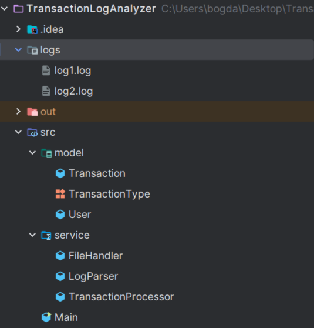
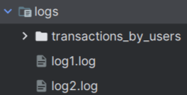
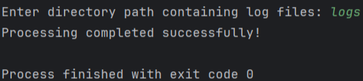

# Transaction Log Analyzer


Аналитическое приложение для обработки логов финансовых транзакций между пользователями. Приложение группирует операции по пользователям и рассчитывает итоговый баланс.

## 📸 Скриншоты

### 1. Структура проекта


### 2. После обработки добавился файл с результатом


### 3. Вывод программы


### Пример входных данных
```
[2025-05-10 09:00:22] user001 balance inquiry 1000.00
[2025-05-10 09:05:44] user001 transferred 100.00 to user002
[2025-05-10 09:06:00] user001 withdrew 50.00
```

## 🚀 Возможности

- Рекурсивный поиск лог-файлов в указанной директории
- Парсинг операций:
  - Проверка баланса
  - Переводы между пользователями
  - Снятие средств
- Группировка транзакций по пользователям
- Автоматический расчет итогового баланса
- Сохранение результатов в отдельную директорию

## ⚙️ Установка и запуск

1. Клонируйте репозиторий:
```bash
git clone https://github.com/yourusername/transaction-log-analyzer.git
cd transaction-log-analyzer
```

## 🛠 Сборка и запуск

### Требования:
- Java 8 или новее
- IntelliJ IDEA (рекомендуется)

### 1. Импорт проекта в IntelliJ
1. Откройте `File` → `Open`
2. Выберите папку проекта
3. Нажмите `OK`

### 2. Ручная сборка через терминал
```bash
# Создаем папку для скомпилированных классов
mkdir -p out/production/classes

# Компилируем исходники
javac -d out/production/classes src/*.java src/model/*.java src/service/*.java

# Собираем JAR-файл
jar cfe transaction-log-analyzer.jar Main -C out/production/classes .

# Запуск
java -jar transaction-log-analyzer.jar /path/to/logs
